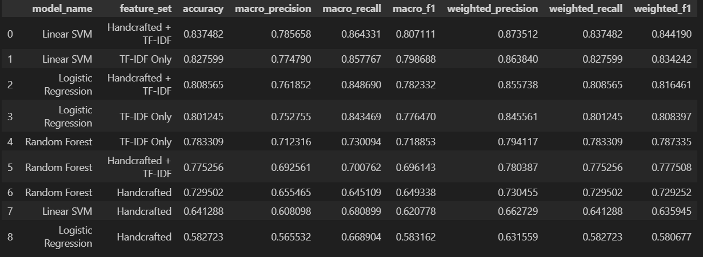
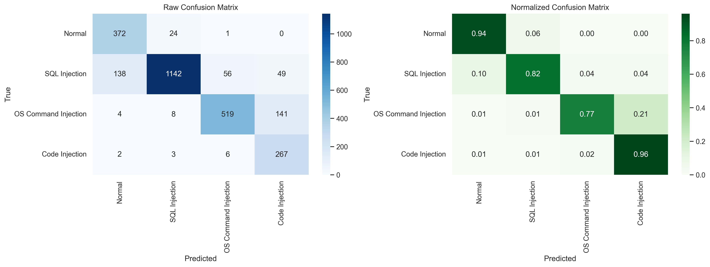
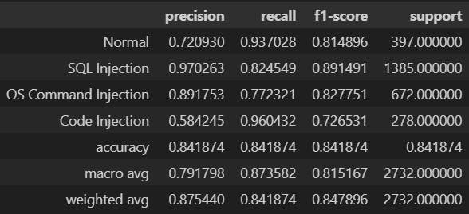
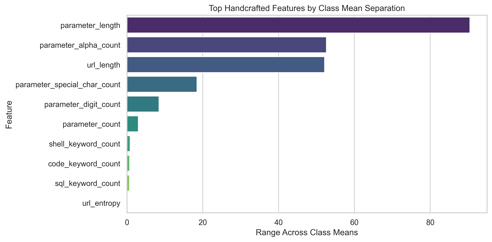
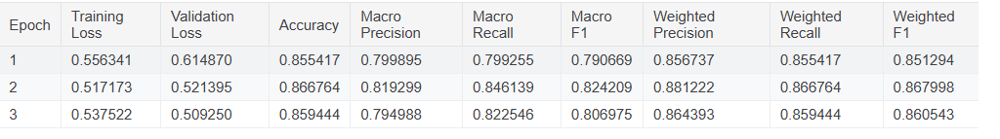
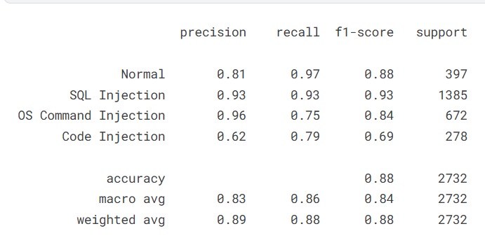
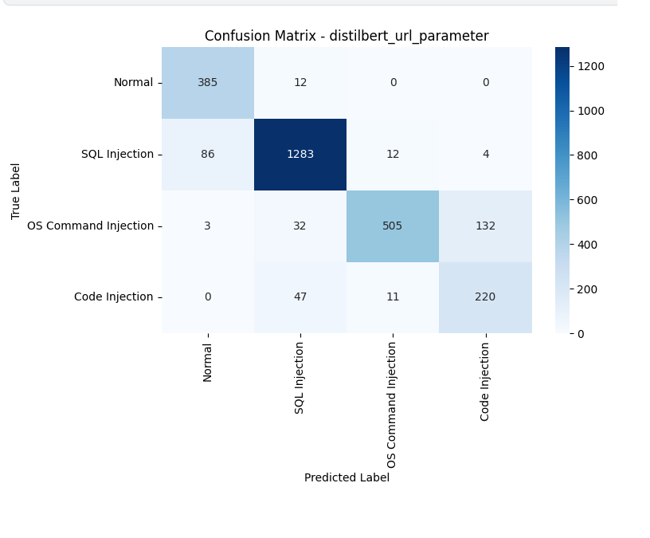
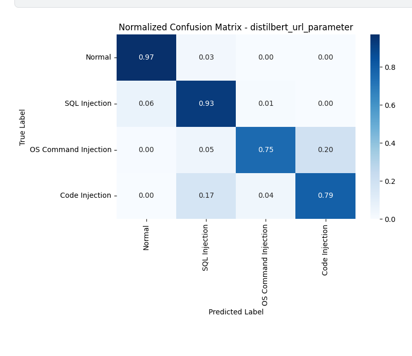

# Attack Request Detection

This repository studies web attack request detection and 4-class attack classification from HTTP request data derived from the SR-BH 2020 dataset. The local workflow focuses on a filtered subset of POST requests and compares classical machine learning baselines with a separate DistilBERT fine-tuning experiment that was run on Kaggle.

The target labels used in this project are:

| Label | Class |
| --- | --- |
| `0` | Normal |
| `1` | SQL Injection |
| `3` | OS Command Injection |
| `4` | Code Injection |

## Dataset Provenance

The original source used for this project is the SR-BH 2020 web attack dataset, available through Kaggle:

- Source CSV: <https://www.kaggle.com/datasets/natasa213/data-capec-multilabel?select=data_capec_multilabel.csv>
- SR-BH 2020 summary: <https://fkie-cad.github.io/COMIDDS/content/datasets/sr_bh_2020/>
- Additional SR-BH information: <https://investigacion.unir.net/documentos/668fc479b9e7c03b01bde810>

Based on the linked dataset documentation, SR-BH 2020 contains traffic collected in 2020 from a WordPress honeypot over 12 days. The published CSV is approximately 436 MB, contains 24 request-level features, and covers 907,814 total requests with multi-label CAPEC-style attack annotations across benign and malicious traffic.

This repository does not train on the full multi-label formulation. Instead, it derives a reduced dataset with the following constraints:

- Only `POST` requests are kept.
- Only rows with a usable request body are kept.
- Only the four target labels listed above are retained.

The filtering and remapping logic is implemented in [scripts/filtered_dataset.ipynb](scripts/filtered_dataset.ipynb).

## Derived Dataset Used for Training

The main training artifact used by the local notebooks is [datasets/post_filtered_attack_dataset.csv](datasets/post_filtered_attack_dataset.csv).

Expected CSV columns:

```text
url
parameter
request_type
label
```

Label meanings:

```text
0 -> Normal
1 -> SQL Injection
3 -> OS Command Injection
4 -> Code Injection
```

Verified dataset statistics from the repository copy:

- Total rows: `19,504`
- Label `0`: `3,085`
- Label `1`: `9,886`
- Label `3`: `4,579`
- Label `4`: `1,954`

The source CSV expected by the filtering notebook is `datasets/data_capec_multilabel.csv`. If that file is not already present in your local copy, download it from Kaggle and place it at that path before reproducing the filtering step.

## Repository Structure

- [datasets/](datasets/) contains the source CSV path expected by the preprocessing notebook and the filtered dataset used for training.
- [scripts/filtered_dataset.ipynb](scripts/filtered_dataset.ipynb) builds the 4-class POST-only dataset from the SR-BH source CSV.
- [scripts/model_training.ipynb](scripts/model_training.ipynb) trains and evaluates the classical ML baselines.
- [scripts/models_output/](scripts/models_output/) contains saved evaluation figures and summary outputs.
- [eda_outputs/](eda_outputs/) contains exploratory plots for dataset inspection.

## Setup

Local reproducibility in this repository currently covers the filtering and classical ML notebooks. The DistilBERT fine-tuning workflow was executed on Kaggle and is documented separately below.

A minimal [requirements.txt](requirements.txt) has been added based on the imports used by the local notebooks. It is intended as a practical starting point rather than a fully locked environment definition.

Recommended local environment:

- Python `3.11.x`
- Jupyter Notebook or JupyterLab
- Packages listed in `requirements.txt`

Install the inferred local dependencies with:

```bash
pip install -r requirements.txt
```

## Reproducibility Workflow

### Classical ML Workflow

1. Download `data_capec_multilabel.csv` from Kaggle if it is not already available locally.
2. Place the file under `datasets/data_capec_multilabel.csv`.
3. Run [scripts/filtered_dataset.ipynb](scripts/filtered_dataset.ipynb) to generate `datasets/post_filtered_attack_dataset.csv`.
4. Run [scripts/model_training.ipynb](scripts/model_training.ipynb) to train and evaluate the mandatory baseline models:
   - Random Forest
   - Linear SVM
   - Logistic Regression
5. Compare the three feature settings used in the notebook:
   - Handcrafted only
   - TF-IDF only
   - Handcrafted + TF-IDF

### DistilBERT Workflow

DistilBERT fine-tuning was run on Kaggle rather than from this local repository:

- Kaggle notebook: <https://www.kaggle.com/code/ahmeterenceylan/bert-attack-request-detection>

Two text input variants were compared during fine-tuning:

- `parameter`
- `parameter + url`

According to the saved project outputs, the `parameter + url` configuration performed better than the `parameter`-only configuration.

## Results

### Classical ML Results

The best validation configuration in the local notebook was:

- Model: `Linear SVM`
- Feature set: `Handcrafted + TF-IDF`
- Validation accuracy: `0.8375`
- Validation macro F1: `0.8071`
- Validation weighted F1: `0.8442`

The selected best model was then evaluated on the notebook's test split with the following reported metrics:

| Metric | Value |
| --- | --- |
| Accuracy | `0.8419` |
| Macro precision | `0.7918` |
| Macro recall | `0.8736` |
| Macro F1 | `0.8152` |
| Weighted precision | `0.8754` |
| Weighted recall | `0.8419` |
| Weighted F1 | `0.8479` |

Per-class test results reported by the notebook:

| Class | Precision | Recall | F1-score | Support |
| --- | --- | --- | --- | --- |
| Normal | `0.7209` | `0.9370` | `0.8149` | `397` |
| SQL Injection | `0.9703` | `0.8245` | `0.8915` | `1385` |
| OS Command Injection | `0.8918` | `0.7723` | `0.8278` | `672` |
| Code Injection | `0.5842` | `0.9604` | `0.7265` | `278` |

Saved figures:

- Validation comparison across all classical models and feature sets: 
- Best classical model confusion matrices: 
- Best classical model score table: 
- Handcrafted feature signal summary: 

### DistilBERT Results

The DistilBERT experiment was trained on Kaggle, and the repository currently stores result snapshots rather than a local fine-tuning pipeline. The saved outputs indicate that the `parameter + url` input performed better than the `parameter`-only variant.

For the saved `parameter + url` result snapshot, the reported overall metrics are:

| Metric | Value |
| --- | --- |
| Accuracy | `0.88` |
| Macro precision | `0.83` |
| Macro recall | `0.86` |
| Macro F1 | `0.84` |
| Weighted precision | `0.89` |
| Weighted recall | `0.88` |
| Weighted F1 | `0.88` |

Per-class values shown in the saved DistilBERT output snapshot:

| Class | Precision | Recall | F1-score | Support |
| --- | --- | --- | --- | --- |
| Normal | `0.81` | `0.97` | `0.88` | `397` |
| SQL Injection | `0.93` | `0.93` | `0.93` | `1385` |
| OS Command Injection | `0.96` | `0.75` | `0.84` | `672` |
| Code Injection | `0.62` | `0.79` | `0.69` | `278` |

These values are transcribed from saved output figures and are presented conservatively because the exact stage labeling in the image snapshot is not fully specified inside this repository.

Saved figures:

- DistilBERT overall metric snapshot: 
- DistilBERT per-class metric snapshot: 
- DistilBERT raw confusion matrix: 
- DistilBERT normalized confusion matrix: 

## Limitations

- This project uses a reduced 4-class subset of SR-BH 2020 instead of the original multi-label CAPEC formulation.
- The derived training dataset keeps only `POST` traffic with usable request bodies.
- The local repository does not currently include a full DistilBERT fine-tuning pipeline or its exact execution environment.
- The added `requirements.txt` is inferred from notebook imports and is useful for local execution, but it is not a fully pinned reproducibility lockfile.

## References and Acknowledgements

- Kaggle dataset page: <https://www.kaggle.com/datasets/natasa213/data-capec-multilabel?select=data_capec_multilabel.csv>
- SR-BH 2020 dataset summary: <https://fkie-cad.github.io/COMIDDS/content/datasets/sr_bh_2020/>
- SR-BH information page: <https://investigacion.unir.net/documentos/668fc479b9e7c03b01bde810>
- Original paper listing for SR-BH 2020 context: <https://www.sciencedirect.com/science/article/pii/S0167404822001833>
- Kaggle DistilBERT training notebook: <https://www.kaggle.com/code/ahmeterenceylan/bert-attack-request-detection>
- GitHub README guidance used when planning this document: <https://docs.github.com/en/repositories/managing-your-repositorys-settings-and-features/customizing-your-repository/about-readmes>

## License Status

No license file is currently present in the repository root.
